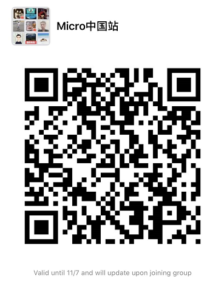

# 声明

**Micro China**[[micro-in-cn](https://github.com/micro-in-cn)]是Micro（London）关注的组织，并非伦敦官方所直属的组织。任何非Micro的组织或个人的任何言论、代码等均不代表Micro，任何非Micro China的组织或个人的任何言论、代码等均不代表Micro China。

**Micro China**正处于高速发展之中，其发展现状、用户反馈等，都会受到Micro(London)的充分关注与能力支持。

**Micro China**包含两个部分：
+ Micro China Team[micro-in-cn](https://github.com/micro-in-cn),关键词是：核心、权威、准确、质量.
+ Micro Open Community[micro-community](https://github.com/micro-community)，关键词是：更开放、更自由、更活跃、MGC(member generate content).

## 交流

请加入[slack](http://slack.micro.mu/)，进入**中国区**Channel沟通。

请加入[meetup](https://www.meetup.com/Micro-Services-Network/)，我们会在上面发布重要的事件。

或者关注微信公众号、微信群：

 

微信群已不能扫码登录，请扫码加好友，并注明“姓名+github”

## 捐赠

[链接](./donation/README.md)

## 加入Micro China Team

预备条件：

1. 热爱开源，愿意与全世界的开发者们一起分享代码.
2. 在编码逻辑、算法、网络、架构、设计等开发相关的方向和领域里，至少有一个突出点.
3. 参与过、正在参与、即将参与go-micro、micro相关的开发。
4. 良好的英文技术文档阅读能力，能听、说更好.
5. 享受coding带来的乐趣，愿意为大家服务.
6. [更多详情...](./we-need-you.md)

麻烦添加微信：SLliuxian，备注姓名

## 加入Micro Open Community

1. Micro China Team 致力于为的每一个micro爱好者，提供广阔而激动人心的创新、创意平台.
2. 对于有热情你，非常欢迎加入[Micro Open Community](https://github.com/micro-community).
3. 在[Micro Open Community](https://github.com/micro-community)，你几乎可以发布任意Idea，并融入Micro China.
4. 了解流程，加入Micro开放平台：[Join Micro Open Community](https://github.com/micro-community/how-to-join).
5. [更多详情...](./we-need-you.md)

## 我们现在需要

1. 丰富的教程
2. 实战项目的分享
3. 运维级Ops集成教程
4. ...

## 常见问题

请开issue，我们会一一解答，谢谢大家。
